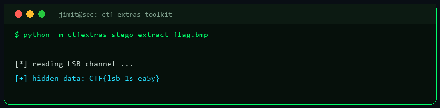

# CTF Extras Toolkit

[](https://github.com/JIMIT-PARIKH-01/ctf-extras-toolkit/actions/workflows/ci.yml)
 

Two CTF helpers — **dependency-free**, GUI + CLI.

1. **LSB steganography** — hide/extract a text message in the least-significant bits of a
   **24-bit BMP** image (round-trip verified). Classic stego-challenge tooling.
2. **Writeup generator** — turn challenge details into a clean, consistent Markdown writeup.

Standard library only (`struct`, `datetime`). Python 3.8+.
(BMP keeps stego dependency-free; PNG/JPEG would need Pillow.)



## Run
```powershell
python ctfextras/gui.py           # GUI (tabs: Steganography / Writeup), or run.bat

python -m ctfextras stego hide  in.bmp "flag{hidden}" --out out.bmp
python -m ctfextras stego extract out.bmp
python -m ctfextras writeup --name "Baby RSA" --category crypto --points 100 ^
    --flag "flag{...}" --step "Recover p,q" --step "Compute d" --tool RsaCtfTool
```

## Layout
```
ctf-extras-toolkit/
└── ctfextras/
    ├── stego.py     # 24-bit BMP LSB hide/extract
    ├── writeup.py   # Markdown writeup generator
    ├── cli.py  gui.py  run.bat
```

MIT — see [LICENSE](./LICENSE).

## ⬇️ Download & Install

**This is a public tool — download and use it on your device for free.**

```bash
# 1) Clone it
git clone https://github.com/JIMIT-PARIKH-01/ctf-extras-toolkit.git
cd ctf-extras-toolkit

# 2) ...or download a ZIP (no git needed)
#    https://github.com/JIMIT-PARIKH-01/ctf-extras-toolkit/archive/refs/heads/main.zip

# 3) ...or install the command straight from GitHub
pip install git+https://github.com/JIMIT-PARIKH-01/ctf-extras-toolkit.git
```

Then run it as shown in the usage section above (CLI `python -m ...`, or launch
the GUI via `run.bat`).

<details>
<summary><b>🔒 Requesting access to a private tool</b></summary>

Public tools install with the commands above. If a tool is **private**, access
is granted by the owner through GitHub — a static link cannot unlock private
code, only GitHub can:

1. **Request access** — open an [access request](https://github.com/JIMIT-PARIKH-01/JIMIT-PARIKH-01/issues/new?template=tool-access-request.md&title=Access+request:+ctf-extras-toolkit) or message on
   [LinkedIn](https://www.linkedin.com/in/jimit-devangkumar-parikh/).
2. The owner reviews it and, if approved, **adds you as a collaborator** on the
   private repository.
3. GitHub then lets you clone / download it with your own account. Access is
   revoked the moment the owner removes you as a collaborator.

</details>

